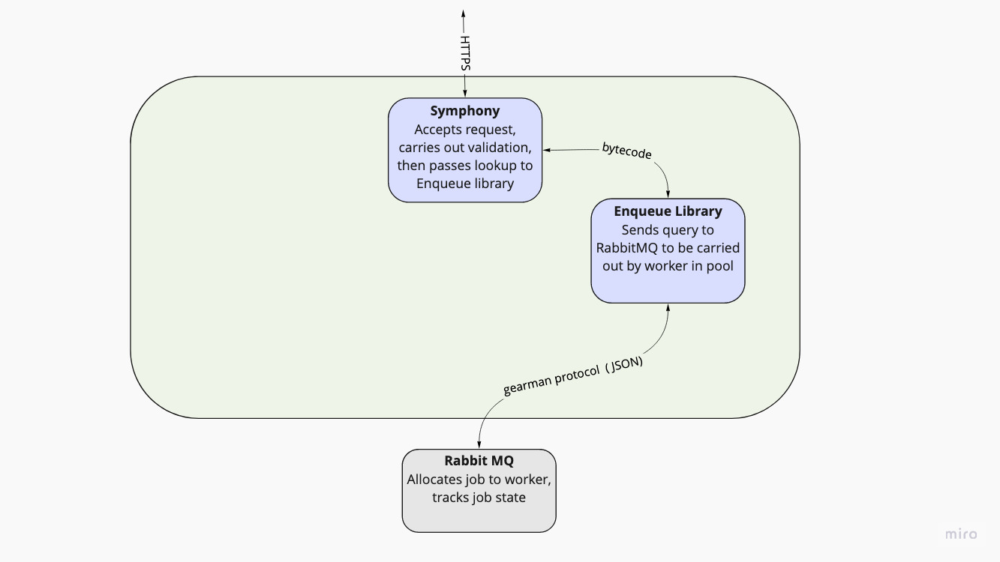
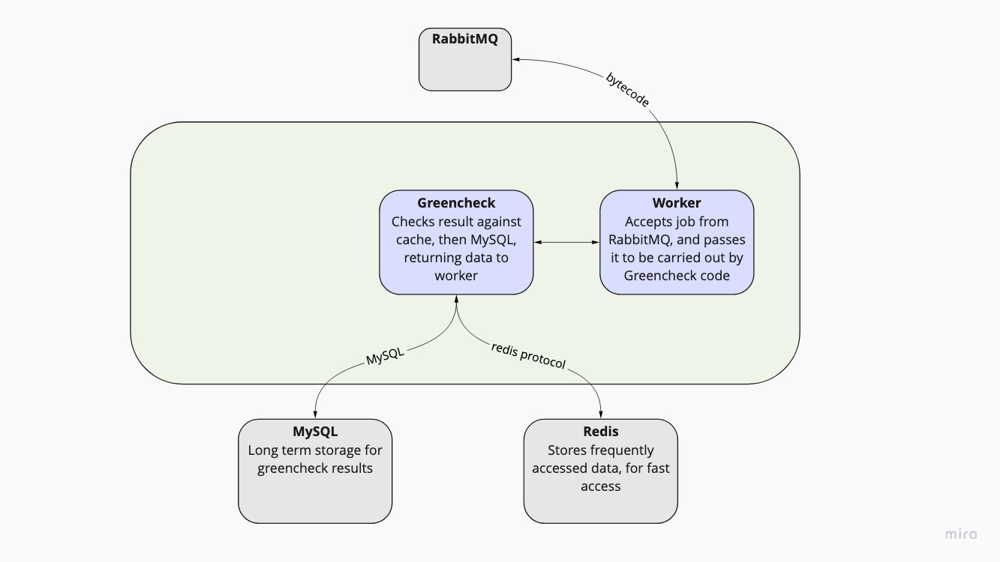

# Green Web Foundation API

In this repo you can find the source code for the API and checking code that the Green Web Foundation servers use to check the power a domain uses.

## Overview

Following [Simon Brown's C4 model](http://c4model.com/) this repo includes the API server code in `apps/api`, along with the green check worker code in `packages/greencheck`.

# Apps - API Server at [api.thegreenwebfoundation.org](http://api.thegreenwebfoundation.org/)

In `/apps/api` is the code served to you when you visit http://api.thegreenwebfoundation.org.

When requests come in, symfony accepts and validates the request, and creates a job for enqeueue to service with a worker.

See the [project readme](apps/api/readme.txt) for further installation and deployment instructions.

# Packages - Greencheck

In `packages/greencheck` is the library used for carrying out checks against the Green Web Foundation Database. Workers take jobs in a RabbitMQ queue, and call the greencheck code to return the result quickly, before passing the result, RPC-style to the original calling code in symfony API server.

# Packages - public suffix

In `packages/publicsuffix` is a library provides helpers for retrieving the public suffix of a domain name based on the Mozilla Public Suffix list. Used by the API Server.
